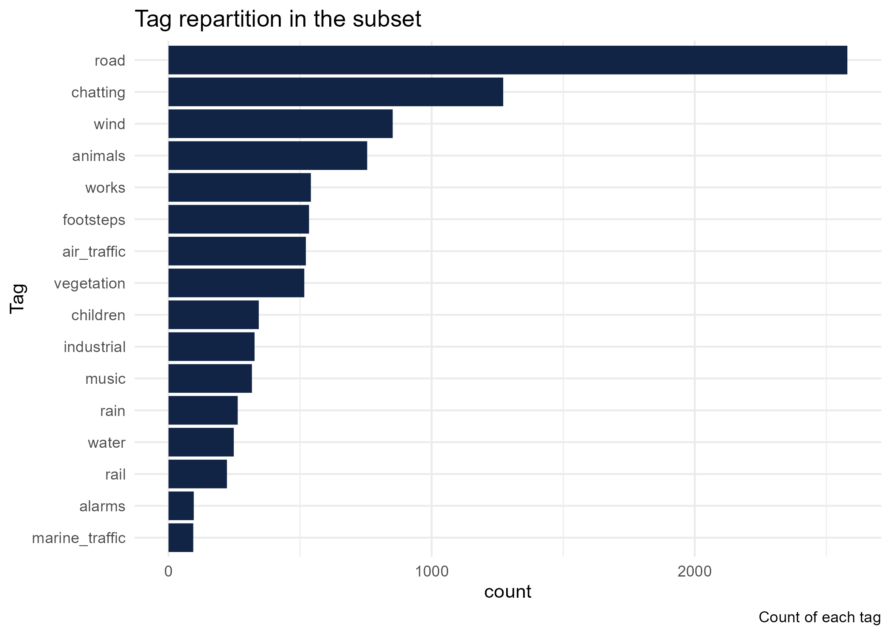
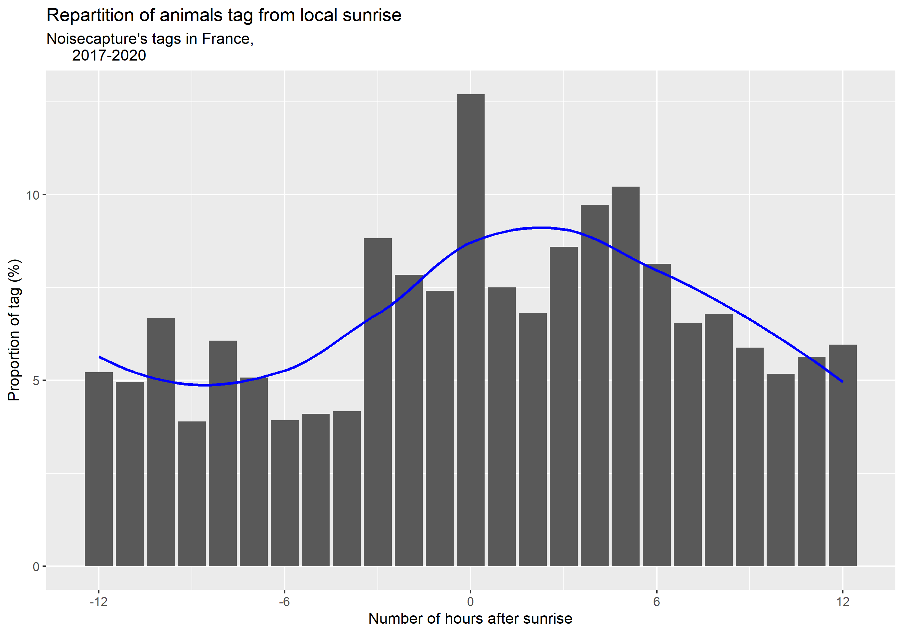
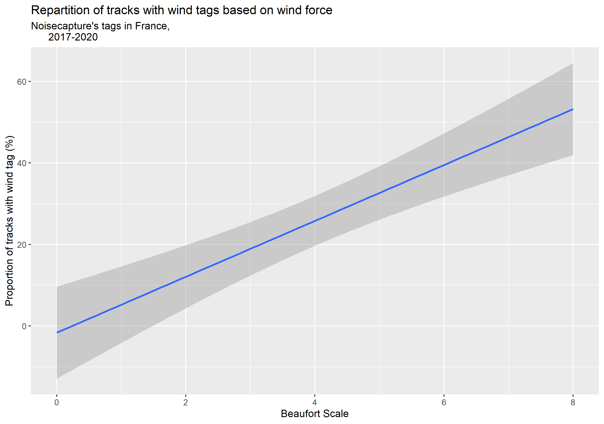

```{r, include = FALSE}
knitr::opts_chunk$set(
  collapse = TRUE,
  comment = "#>",
  echo = FALSE
)
```

```{r comments, include=FALSE}
#' Call for paper : https://2022.foss4g.org/cfp-academic_track.php
#' Submission of academic abstracts 	from 06/12/2021 	to 28/02/2022
#' Announcement of accepted abstracts 		01/04/2022
#' Submission of full academic papers 		01/06/2022
```

# Keywords {-}
Environmental acoustics, crowdsourced open data, FOSS4G, reproducibility,
literate programming, Open Science, 
Open Geospatial Software, Open GIScience, Open Geospatial Data 

# Abstract {-}
<!--TODO modifier l'abstract en évitant de copier coller l'intro -->

[NoiseCapture](https://noise-planet.org/noisecapture.html) is a Android application 
developed by the [Gustave Eiffel University](https://www.univ-gustave-eiffel.fr/)
and the [French National Centre for Scientific Research](https://www.cnrs.fr/en/cnrs) 
as central element of a participatory approach to environmental noise mapping.
The application is open-source, and all its data are available freely.

This study presents the results of the first exploratory analysis of 3 years of 
data collection through the lens of sound sources.

Sound dynamics of roads related to commuting or bird songs have been observed. 
The first results are therefore encouraging. 
This analysis is based only on the tags given by the users and not on the sound 
spectrum of the measurement, which will be studied at a later stage. 

As this preparatory work will be consolidated and extended later, and with the will
to register this study in the framework of the Open Science, we paid attention 
to its reproducibility. 

The context of the study, the tools and techniques used and the first results 
obtained will be presented as well as the benefits of using literate programming 
in this type of preparatory work.


# Introduction {-}

NoiseCapture[^1] is an Android application developed by the Gustave Eiffel University[^2] 
and the CNRS[^3] as part of a participatory approach to environmental noise mapping. 
The application is open-source and all collected data are available under an Open Database License.

[^1]: https://noise-planet.org/noisecapture.html
[^2]: https://www.univ-gustave-eiffel.fr/en/
[^3]: https://www.cnrs.fr/en

The study presented here is the first exploratory analysis of the first three years of data 
collection, through the prism of noise sources. The analysis only focused on the 
labels filled in by the users and not on the sound spectrum of the recordings, 
which will be studied later.

The aim was to determine whether known dynamics in environmental acoustics could
be recovered using collaborative data.

As these first exploratory works will be extended and consolidated thereafter, and with 
the will to include this study within the framework of the Open Science, an 
attention was brought on the reproducibility aspect of the analysis. 
It was entirely realized with free software and literate programming techniques.

The context of the study, the implemented methodology and the first results 
will be presented as well as the benefits of using literate programming 
in this type of exploratory work.

# Context

<!-- Présentation de l'acoustique environnementale et du projet NoiseCapture -->

The beginining of this analysis was the release of a 3 years collection of environnemental
acoustic samples. A first article presenting this dataset has been published in 2021 [@picautSmartphoneBasedCrowdSourcedDatabase2021].

It details the structure of the database and the data, the profile of the 
contributors and the contributions but does not analyze the content of the data. 
This is what this article proposes to begin.

## Methodology

As the NoiseCapture application is Open Source and the data collection infrastructure 
use Free and Open Source Softwares (FOSS), we decided to pursue this by using 
open source software and data for the analysis part.

First, we will introduce the dataset then we will present the tools we used and why we choose them.

### Data

The data used in this study are contributions made by the user of the application
between August 29, 2017 and August 28, 2020.
During this period, nearly 70,000 unique contributors allowed 
the collection of more than 260,000 tracks for a total of about 60 million seconds 
of measurement. A track (or *trace*) is a collected recording, it contains the 
record of the sound spectrum (1 second, third octave) recorded by the phone microphone 
coupled with its GPS positioning (1 second). Each track is timestamped too.

The 3 years collection dataset is available with an Open Database License through
the Gustave Eiffel university Dataverse[^4].

[^4]: https://research-data.ifsttar.fr/dataset.xhtml?persistentId=doi:10.25578/J5DG3W


This information can be enriched by the contributor with labels. 
There are 18 predefined labels and the user can select one or more of them for each of the 
traces made. The labels are detailed in [@picautSmartphoneBasedCrowdSourcedDatabase2021]. 
The preliminary work presented here focuses on the analysis of the proportion of 
certain labels in the global sample at certain temporalities.

In addition to data from the collaborative collection, some additional data were 
used to limit the study area. First we chose to limit the geographical scope of this 
preliminary study to metropolitan France because this area contains the largest 
number of recordings and it avoided us to face the problems of time zones.
Then we extended some analysis worldwide.

To facilitate the reproducibility of spatial filtering, it was decided to use 
open data sets from recognized sources: the Natural Earth database 
[@pattersonNaturalEarth2021] and the Admin Express database from the French
National Institute of Geographic and Forest Information [@institutgeographiquenationalAdminExpress].

The raw data has been stored and pre-filtered in a geospatial database and has been
analysed using a statistical analysis language.

### Tools{#tools}

In order to be as open as possible and to work in the most collaborative way,
we decided a FOSS toolset: PostGreSQL/Postgis to store the data and the R language 
to analyse and produce knowledge from it.
We also used Git as it is a great tool to facilitate remote collaboration.

#### PostGIS

The data are provided as a dump from a PostGreSQL/PostGIS database [@paulramseyPostGIS2001].
Several scripts perform much of the attribute and spatial filtering. 
These filterings are saved in a materialized view.
This view is the entry point for the R language.

#### R

The R language [@rcoreteamRLanguageStatistical2021]
is a programming language for data processing and statistics with many libraries 
dedicated to geospatial data. 
 
The use of Rmarkdown is one of the recommended means for literate programming (along with Jupyter Notebooks and Emacs Org-Mode [@desquilbet2019ReproducibleResearch])

R allowed us to query the database to get data, refine it to our needs, then produce
data analysis and graphs.
Rmarkdown allows to mix code in several programming languages and text in markdown for the dynamic production of 
graphs, tables and documents.
So it is a great tool to either communicate inside our team and publish our results.


Rmarkdown, as any markdown file, is a plain text file that can be easily versionned
with any version control system.
As our team is scaterred in several places in France, we needed a tool to 
facilitate code sources communication, for this purpose, we used git.

#### Git

Git is a Distributed Version Control System (DVCS) [@chacon2014pro]. 
It enables collaborative and decentralized work.
The choice of Git was natural as different collaborators are present on several
sites (Nantes, Lyon, Paris) and Git is already used within the UMRAE laboratory.

### Implementation
The data are provided in the form of a PostGreSQL/PostGIS dump. 
A server has been set up accordingly to the documentation provided and the data loaded.  
A materialized view was created in order to provide a stable access to the data 
corresponding to the defined criteria. 

These criteria are both attributive and spatial. 
We removed from the analysis the tracks taggued *test* or *indoor* as we wanted outdoor recording. 
Short tracks (duration less than 5 seconds) and long tracks (duration longer than 15 minutes)
have been removed. 
We kept the tracks where the GPS median accuracy was less than 20 meters. 
We decided to keep tracks that are comprised in a rather small area, 
the bounding box area of the track should be less than 625 square meters which 
corresponds to a square of 25 by 25 meters.

To extract data regarding France area, we pre-filtered the data
using the NaturalEarth dataset to keep tracks that are within the France country.
This spatial filtering was implemented by creating a materialized view within the 
PostGIS database.
The materialized view is a good compromise between a table and a view because it
has similar response time to a table and also allows us to recompute 
values easily if the threshold values changed.

NaturalEarth is a great dataset and is well known worldwide however it does not
distinguish France metropolitan area from overseas areas.
This could have introduce complications with timezone handling.

Plus we wanted to be able see if seasons have distinct dynamics.
Metropolitan France has a temperate climate [@ClimatFranceMetropolitaine] 
where the climate in the West Indies, Reunion, New Caledonia and Polynesia is of
the tropical maritime type [@ClimatsOutremerMeteoFrance].
That motivated our need to separate overseas records from metropolitan ones

In order to facilitate the replication of the study on areas without this kind 
of issues, this as not been done within the database but at the beginning of the 
Rmarkdown document where analysis is conducted.

The code producing the analysis and the graphics presented here are separated in 
several complementary documents[^5].

[^5]: https://nicolas-roelandt.github.io/lasso-data-analysis/articles/temporal_exploratory_analysis.html

The Rmarkdown document establishes the connection with the materialized view and then 
performs the operations allowing to finalize data preparation and analyze the data.
It is a document mixing narrative, figures and code (in R but also several programming languages).

In this document, we refine the spatial filtering to France's metropolitan area 
using an authoritative dataset [@institutgeographiquenationalAdminExpress].
We also transform the track timestamp to local time and compute seasons using the R packages 
`lubridate` from the `tidyverse` metapackage [@wickhamWelcomeTidyverse2019] and 
`hydroTSM` [@mauriciozambrano-bigiariniHydroTSMTimeSeries2020].

We also used the `suncalc` package (@thieurmelSuncalcComputeSun2019) to compute 
the sunrise time of the day of the track at its location.

# Results
## Environmental acoustics results 

The main goal of this preliminary study was to verify the scientific value of 
crowdsourced acoustic data and if tags are sufficients to describe user environment.

The study concerns tracks bearing a tag, recorded in metropolitan France. 
It focuses on the proportion of a certain tag in relation to all the tags for a 
given period (time of day, season, etc.). 
In the sample studied, it is possible to note a large prevalence of the  *road* 
tag as shown in Figure \@ref(fig:tag-representation). 
*chatting*, *animals* and *wind* tags are also well represented.

```{r tag-representation, fig.cap="Tag representation in mainland France"}

```

Noise pollution due to road noise is a major concern in France.

### Acoustic dynamics of bird song and commutes

A first axis of analysis concerns the time distribution of the tags. 
Figure  \@ref(fig:animals-sunrise) shows that animal noises (tag *animals*) are more frequent in the morning and especially 
in the few hours after sunrise.
This is a well known dynamic for bird song [@robbins1981effect]
and our data shows a similar effect.

<!--TODO: Remplacer par le graphique de Ludovic -->
```{r animals-sunrise, fig.cap="Animals dynamics"}

```

We also observed peaks in human activity, especially commuting (see Figure 
\@ref(fig:road-dynamics).
Although we find a difference from commuting times shown by @MA2017135, with a 
rise from 8 am and a peak around 2 pm.

<!--TODO: Remplacer par le graphique de Ludovic -->
```{r road-dynamics, fig.cap="Road dynamics"}
knitr::include_graphics("plots/road_local_time")
```

Seeing those dynamics was a good sign regarding the validity of crowdsourced 
environmental acoustic data. 
However, we wanted more precise quality indicators so we looked if we were able 
to correlate the mention of physical events in the dataset and records of thoses
events in an authoritative database.

### Correlation between tags and physical events in the user environment

As we know the user position and we have the time stamp of the recording, we are 
able to determine the weather conditions at that time and place using the services
of Météo-France, the French national meteorological service.

In order to determine the accuracy of the manually selected tags by the users of the NoiseCapture app, we want to proceed simple investigations concerning some tags that concern physical events, such as the weather related ones (rain,wind), which can be verified later on.

The weather data used is from France's national weather organisation Météo-France, available along with its full documentation from their website :
  [French weather data](https://donneespubliques.meteofrance.fr/?fond=produit&id_produit=90&id_rubrique=32)

It is to keep in mind that the weather data available to us via this method is limited to the one measured at weather stations. We coded a function getting the weather observed at the closest station. The median distance between stations and our tracks is **16.1 kilometers**, resulting in a small margin of error, the weather being susceptible to change on such a distance.  

```{r rain-tag-use, fig.cap="Rain tag use"}
knitr::include_graphics("plots/rain_repartition.png")
```

```{r wind-tag-use, fig.cap="Wind tag use"}

```

The proportion of "wind" and "rain" tags seem to correlate with their corresponding physical events.
In order to create those graphs, we selected scales to group our data (wind force and precipitation) and calculate the proportion of tags present in those groups. We tried to create groups of equal representation for our data, but our data being non-uniform and disparate, some of our groups of data are much less populated than others, creating a potential bias that could only be corrected by the aggregation of more participator's data. This issue also explains why there is such a large confidence zone of potential linear regression on figure \@ref(fig:rain-tag-use).

**The correlation coefficient between rain tags and the amount of rain is estimated at 0.5 with a p-value of 0.391.**

**The correlation coefficient between wind tags and the strength of rain is estimated at 0.93 with a p-value close to zero.**


  
## Benefits of OpenScience and literate programming


Intrinsically, Free and Open Source Software (FOSS) brings many benefits to a 
project, whether it is a scientific one or not.
The problem of licenses is greatly facilitated because they are usable by all, 
without discrimination and without additional cost.
The question of having to acquire licenses and how to do so is no longer an issue.
Another advantage, as long as one has the necessary skills, is to be able to adapt 
the tool to one's needs, an important quality in an often innovative field.
Free software favors interoperability and this aspect is important when creating 
complex processing chains, implementing several different tools.

As shown in Section \@ref(tools), this study use a rather small toolset of FOSS.
The reduction of the number of tools needed for the scientific production was 
possible thanks to the use of a programming language allowing to cover practically 
all the aspects of the project, whether it is the connection to the database, 
the statistical analyses, the production of tables and graphs as well as reports.

While free software facilitates the implementation of tools, literate programming is 
more oriented to communication between humans.
Thus, as early as 1984, Donald Knuth, who invented the concept, questions the 
relationship between the developer of a program and the source code he produces.
He proposes that, beyond the simple transmission of instructions to a computer, 
the source code should be a means of communicating the intentions of the developer 
to another human being [@knuth1984LiterateProgramming].

As @schulte2012MultiLanguageComputingEnvironment explains, literate programming 
mixes source code and natural language, divided into blocks of instructions for 
the computer and blocks of text for human understanding. The code blocks are 
useful for scientific production because they participate in data processing and 
information extraction, while the text blocks are intended to explain both the 
methods and the results for the benefit of the human reader.

In the context of scientific research, the benefits brought by free software and 
literate programming are valid at several levels: for oneself, for the team/laboratory, 
for the scientific community.

For oneself, the advantages are numerous, they allow to serenely resume work on 
a subject even after a break of several months if the code is sufficiently documented.
Literate programming allows one to go further than just commenting on the code 
because the information can be organized, prioritized and developed.
The commentary of a figure is as close as possible to the figure and the code 
that produced it.
By restarting the analysis, it is possible to see if all the conditions are met 
to resume the work: is the necessary software present? Is the data accessible?
Does the code still work after the updates?

For the team or the laboratory in which the project takes place, the benefits 
are also numerous.
The work done is accessible, especially if collaborative tools have been 
put in place.
Within the framework of the analysis presented here, an initial exploratory 
analysis revealed certain known dynamics in environmental acoustics.
This motivated the recruitment of a new team member to carry out a more thorough analysis. 
The problem of setting up the database did not arise again because the server 
used for the exploratory analysis was still functional.
Nevertheless, the other technical aspects of the analysis (creation of SQL views, 
connection and interrogation of the database with R, etc.)
would have been more difficult to master if they were not already illustrated in 
a detailed document.
It is at this point that literate programming comes into its own, since more than 
a series of instructions, the reader is also provided with the methodology and 
the analysis of the results produced.
This represents a considerable time saving at the beginning of the project.

For the scientific community, the COVID-19 health crisis has shown that public 
confidence in the scientific community is fragile.
Especially in times of doubt, when the information provided by studies can be contradictory. 
The production of knowledge in open mode, where everything is described and 
auditable, can help not only the scientific community to validate the soundness 
of the work and the results presented, but also the general public to appropriate them.

For a researcher working on similar questions, a research project where the data, 
methods, code and even the scientific literature produced are open and documented, 
makes it much easier to revisit the work in order to answer one's own questions 
because it provides a complete example and not just final results.

<!-- Pertinence de cette partie ? C'est une limite de la reproductibilité qui n'a 
pas été traitée dans cette étude, c'est un point d'amélioration -->

While being a valuable aid for reproducibility, the FOSS and literate programming
with notebook tools such as Rmarkdown used in this project suffer from some limitations. 
It is possible to restart the calculations by trying to
to reproduce the software environment (the versions of the software and packages used are provided),
but there is no guarantee that the result will be exactly the same.

The package R [renv](https://rstudio.github.io/renv/index.html) can help to reproduce an R environment and 
environment by providing functions for saving and restoring dependencies at the project level.
In some cases, if this is not enough, it will be necessary to turn to higher-level
solutions such as [Docker](https://www.docker.com/) and [Guix](https://guix.gnu.org/).

# Conclusion {-}
The first results are encouraging because road dynamics related to commuting or 
animal activity can be observed.
The main question was to determine if these known dynamics in environmental acoustics 
can be observed in a crowdsourced dataset.
The first elements seem to answer positively to this question.

Some questions still need to be explored, notably those concerning the 
representativeness of samples that are sometimes weak for certain time periods.

The systematic use of open source software, the provision of documented code files 
and a document mixing narrative, figures and code have allowed the resumption and
continuation of the analyses shown here.

We also wanted to show that Free and Open Source Software can be used to produce 
scientific knowledge all along the production chain, from data collection, 
storage, analysis and even presentation.
By mobilizing only a few tools, it is quite possible to produce scientific 
knowledge in a more reproducible way.


We are aware that the acquisition of the necessary skills to mobilize these tools 
is not easy but we believe that the gain is much higher than the cost. 
For the more technical parts, such as the implementation of database servers, 
the presence of a research software engineer is a real plus.

# References {-}
